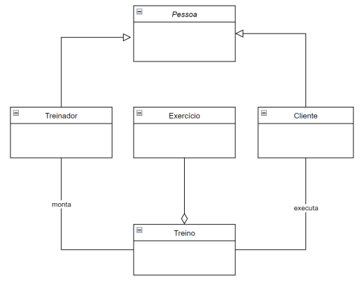

# Sobre

Este repositório foi desenvolvido para adicionar a resolução dos exercícios da instrução prática 4 do módulo de .NET da Residência em Software promovido pela CEPEDI em parceria com a UESC.

# 📑Instruções práticas

<Strong>Objetivo:</strong> Desenvolver um sistema de gerenciamento da academia Tech Fit.

<strong>Desenvolvimento:</strong> Implementar, obrigatoriamente, o gerenciamento das entidades abaixo e seus atributos, com as opções (telas) de inserir e remover para cada entidade. Além disso, a geração dos relatórios solicitados e a regra de negócio de acordo com o especificado abaixo. Classes acessórias devem ser implementadas a critério do grupo. Exemplo: uma classe base Pessoa para implementar herança e polimorfismo entre Treinador e Cliente; uma classe Academia (ou App) que vai implementar as telas, lógica e regras de negócio. O grupo não deve se restringir a, apenas, estas classes.

<strong>Classes:</strong>

#### Treinador

| Atributo           | Tipo      | Observação                                   |
|--------------------|-----------|----------------------------------------------|
| Nome               | String    |                                              |
| Data de Nascimento | DateTime  |                                              |
| CPF                | String    | Tratar entrada com 11 dígitos                |
| CREF               | String    | Deve ser único entre os treinadores          |

#### Cliente

| Atributo           | Tipo      | Observação                                   |
|--------------------|-----------|----------------------------------------------|
| Nome               | String    |                                              |
| Data de Nascimento | DateTime  |                                              |
| CPF                | String    | Tratar entrada com 11 dígitos                |
| Altura em cm       | Int       |                                              |
| Peso em kg         | Int       |                                              |

#### Exercício

| Atributo                     | Tipo      | Observação                                |
|------------------------------|-----------|-------------------------------------------|
| Grupo muscular               | String    |                                           |
| Séries                       | Int       |                                           |
| Repetições                   | Int       |                                           |
| Tempo de intervalo (segundos)| Int       |                                           |

#### Treino

| Atributo                            | Tipo                      | Observação                                  |
|-------------------------------------|---------------------------|---------------------------------------------|
| Tipo                                | String                    |                                             |
| Objetivo                            | String                    |                                             |
| Lista de Exercícios                 | List<Exercício>           |                                             |
| Duração estimada em minutos         | Int                       |                                             |
| Data de Início                      | DateTime                  |                                             |
| Vencimento em dias                  | Int                       |                                             |
| Treinador Responsável               | Treinador                 |                                             |
| Clientes/Avaliação                  | List<(Cliente, int)>      | Pode ser nulo ou conter avaliações de 0 a 10 |

<strong>Regras de negócio:</strong>
- Um treino pode conter até 10 exercícios;
- Um treinador pode associar diversos treinos para diversos clientes
- Cada cliente pode estar associado a, no máximo, 2 treinos
- Ao associar o treino ao cliente, deverá ser registrada a data de Início e o
vencimento (em dias) do treino.
- O cliente pode avaliar um treino

<strong>Relatórios:</strong>
1. Treinadores com idade entre dois valores
2. Clientes com idade entre dois valores
3. Clientes com IMC (peso/altura*altura) maior que um valor informado,
em ordem crescente
4. Clientes em ordem alfabética
5. Clientes do mais velho para mais novo
6. Treinadores e clientes aniversariantes do mês informado
7. Treinos em ordem crescente pela quantidade de dias até o vencimento.
8. Treinadores em ordem decrescente da média de notas dos seus treinos
9. Treinos cujo objetivo contenham determinada palavra.
10. Top 10 exercícios mais utilizados nos treinos

